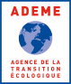
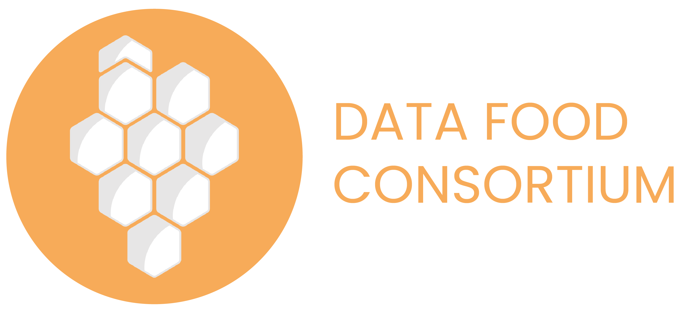
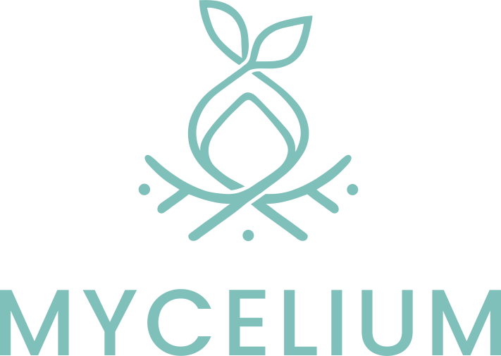
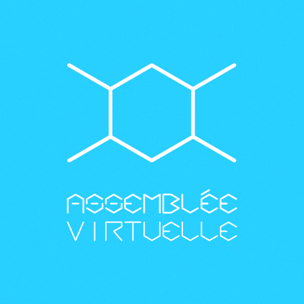

# Semantizer

Semantizer is a TypeScript library to ease the development of applications working with RDF documents. This library is modular and offers mixins that provide useful methods to manipulate [RDF datasets](https://www.w3.org/TR/rdf11-concepts/#section-dataset). Semantizer also give you the ability to easily write your own mixins to fit to your data models. Doing so you can quickly obtain a layer to load, modify and save your RDF data. In particular, this library can be used to build [Solid](https://solidproject.org) applications.

Semantizer supports the whole RDF model out of the box, including blank nodes. The default implementation uses RDFJS but this can be changed. Semantizer can be used in replacement or with other libraries such as LDO or solid-client.

## Get started

```bash
npm install @semantizer/default
```

```ts
import semantizer from "@semantizer/default";
import { webIdProfileFactory } from "@semantizer/mixin-solid-webid";

// To create an RDF dataset
const localDataset = semantizer.build();
localDataset.addLiteral(...);

// To create an RDF dataset using the solid-webid mixin
const localWebId = semantizer.build(webIdProfileFactory);
const localPrimaryTopic = localWebId.getPrimaryTopic();

// To load a distant dataset
const distantDataset = await semantizer.load("http://example.org/dataset");

// To load a distant dataset using the solid-webid mixin
const distantWebId = await semantizer.load("http://example.org/webid", webIdProfileFactory);
const distantPrimaryTopic = distantWebId.getPrimaryTopic();
```

## Available mixins

The base mixin is the "dataset" mixin. It offers basic methods such as `getLiteral()`, `getLinkedObject()` and so on. The documentation of each mixin is available into the mixin directory. Click on the name of a mixin below to access to its documentation.

| Mixin      | Description |
| -----------| ----------- |
| [dataset](./src/mixins/dataset/) | The base mixin. Provides essential methods. |
| [index](./src/mixins/index/) | A mixin to query indexes. |
| [literal-helper-add](./src/mixins/literal-helper-add/) | A mixin that provides helper methods to add literals to the dataset with various datatypes. |
| [solid-webid](./src/mixins/solid-webid/) | A mixin to manipulate [Solid WebId profiles](https://solid.github.io/webid-profile/). |
| [typeindex](./src/mixins/typeindex/) | A mixin to manipulate [TypeIndexes](https://solid.github.io/type-indexes/). |
| [webid](./src/mixins/webid/) | A mixin to manipulate [WebId](https://w3c.github.io/WebID/spec/identity/) profiles. |

## Development

### Mixin development

TDB.

### Core developement

| Package      | Description |
| -----------| ----------- |
| [core](./src/packages/core/) | Text |
| [core-rdfjs](./src/packages/core-rdfjs/) | Text |
| [default](./src/packages/default/) | Text |
| [loader-quad-stream-rdfjs](./src/packages/loader-quad-stream-rdfjs/) | Text |
| [loader-rdfjs](./src/packages/loader-rdfjs/) | Text |
| [rdfjs-dataset-impl](./src/packages/rdfjs-dataset-impl/) | Text |
| [types](./src/packages/types/) | Text |

## Funders and supporters

A great thank to all our ongoing and past funders:

|  | Name | Description |
| -----------| --------| ----------- |
|  | [ADEME](https://www.ademe.fr/) | The Environment and Energy Management Agency is a French public industrial and commercial establishment. As a player in sustainable development, Ademe participates in the implementation of public policies in terms of energy and environmental protection. Also named the Ecological Transition Agency. |
|  | [Fondation de France](https://www.fondationdefrance.org/) | The Fondation de France is a private French organization, recognized as being of public utility and independent. As the leading philanthropy network in France, Fondation de France brings together donors, founders, volunteers and project leaders across the country. Its ambition: to contribute to building effective and sustainable solutions to meet the challenges of society. |
|  | [Fondation Crédit Coopératif](https://fondation.credit-cooperatif.coop/) | The Crédit Coopératif Foundation is a French non-profit corporate foundation who supports projects that accelerate the transformations of the ESS and increase its influence, for a more just and united society, in harmony with the planet. |
|  | [INRIA](https://inria.fr/) | The National Institute for Research in Computer Science and Automation is a French public scientific and technological institution specializing in mathematics and computer science. Also called the National Institute for Research in Digital Science and Technology. |
|  | [Startin'Blox](https://startinblox.com/) | Startin’blox is a company who develops an innovative and ethical technology based on interoperable standards. It goes against the multiplication of siloed proprietary platforms logic, and argues that a truly open web must be built now. |

This library is supported by these projects or organizations:

|  | Name | Description |
| -----------| --------| ----------- |
|  | [Data Food Consortium](https://www.datafoodconsortium.org/) | Data Food Consortium is an international collective of actors working on a interoperability project between short food supply chain platforms in order to allow them to communicate. It aims to support, equip, and give more space to producers, independent distributors and short supply chain.  |
|  | [Mycelium](https://mycelium-software.org) | Mycelium is a digital commons project for farmers. Its objective is to equip the farming world with management applications that are interoperable, free and ethical. Its scope extends to the management of farming activity as a whole: invoicing, production, planning, distribution, etc. |
|  | [Assemblée Virtuelle](https://assemblee-virtuelle.org/) | The Virtual Assembly is a French association who brings together an ecosystem of actors developing common resources together to serve the transition. The softwares developed or promoted within the Virtual Assembly are intended to promote the development of decentralized and federated information systems, serving the autonomy and networking of their user communities. |

## History

This library was writen for the [Data Food Consortium](https://datafoodconsortium.org) project (DFC) which aims to provide interoperability between food supply chain platforms. We use the semantizer library inside our connector library to help developers to exchange data expressed with the DFC ontology.